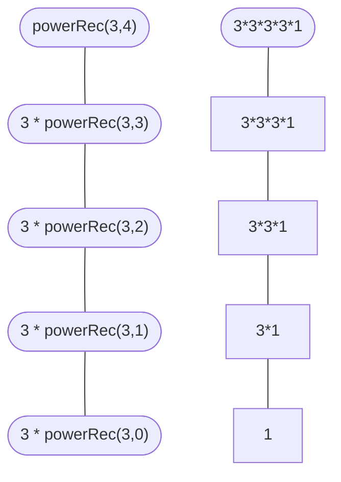
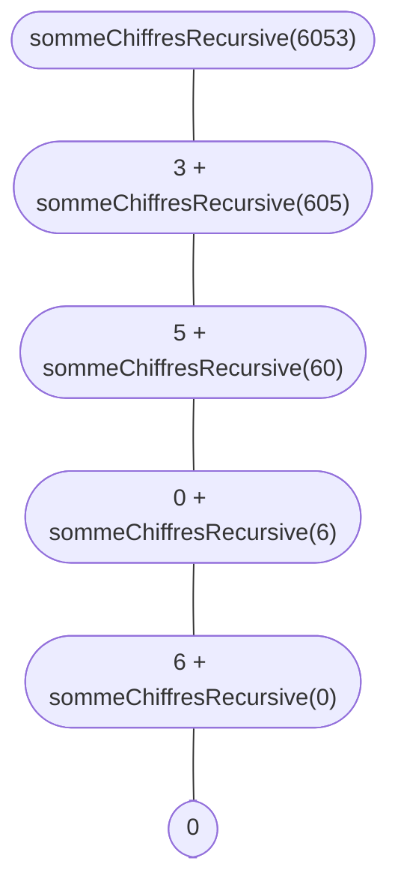

Exercices : [1](#1) [2](#2) [3](#3) [4](#4) [5](#5) 


> Regarder la correction uniquement après avoir travaillé par vous-même, car si vous ne le faites pas, c’est le meilleur moyen de rater vos DS/CC.
{: .prompt-danger }


<div id="1"></div>

## Exercice 1

{: .w-75 .shadow .rounded-10 }


1. On crée la version itérative du programme
 

```c 
int powerIt(int a, int b) {
    int result = 1;
    for (int i = 0; i < b; i++) {
        result *= a;
    }
    return result;
}

``` 


2. On crée maintenant la version récursive du programme
 

```c 
int powerRec(int a, int b) {
    if (b == 0) {
        return 1;
    }
    return a * powerRec(a, b - 1);
}

``` 


3. On dessine l'arbre de récursion de la fonction
 



<div id="2"></div>

## Exercice 2

{: .w-75 .shadow .rounded-10 }

+  On crée la fonction recursive selon la formule du coefficient binomial 
 

```c 
int coefficientBinomial(int n, int p) {
    if (p == 0 || p == n)
        return 1;
    return coefficientBinomial(n - 1, p - 1) + coefficientBinomial(n - 1, p);
}

``` 

<div id="3"></div>

## Exercice 3

{: .w-75 .shadow .rounded-10 }


1. On affiche le tableau de manière récursive :
 

```c 
void printArray(int arr[], int size) {
    if (size == 0) {
        printf("\n");
        return;
    }
    printf("%d ", arr[size - 1]);
    printArray(arr, size - 1);
}

``` 


2. Trouver le maximum d'un tableau de manière récursive :
 

```c 
int findMax(int arr[], int size) {
    if (size == 1)
        return arr[0];
    return max(arr[size - 1], findMax(arr, size - 1));
}

``` 


3. Compter le nombre d'éléments divisibles par 3 dans un tableau de manière récursive (en partant du début) :
 

```c 
int compterdivisible3debut(int arr[], int size) {
    if (size == 0)
        return 0;
    return (arr[0] % 3 == 0) + compterdivisible3debut(arr + 1, size - 1);
}

``` 

+  3.b Compter le nombre d'éléments divisibles par 3 dans un tableau de manière récursive (en partant du fin) :
 

```c 
int compterdivisible3fin(int arr[], int size) {
    if (size == 0)
        return 0;
    return (arr[size - 1] % 3 == 0) + compterdivisible3fin(arr, size - 1);
}

``` 

<div id="4"></div>

## Exercice 4

{: .w-75 .shadow .rounded-10 }

1. Fonction itérative sommeEntiers :
 

```c 
int sommeEntiers(int a, int b) {
    int sum = 0;
    for (int i = a; i <= b; i++) {
        sum += i;
    }
    return sum;
}

``` 


2. Définition récursive avec somme croissante :
 

```c 
int sommeEntiersCroissant(int a, int b) {
    if (a == b)
        return a;
    return a + sommeEntiersCroissant(a + 1, b);
}

``` 


3. Définition récursive avec somme décroissante :
 

```c 
int sommeEntiersDecroissant(int a, int b) {
    if (a == b)
        return a;
    return b + sommeEntiersDecroissant(a, b - 1);
}

``` 


+  Pour tester les fonctions de l'exercice 4 avec des valeurs de paramètres aléatoires entre 100 et 200, on fait :
 

```c 
int main() {
    srand(time(NULL)); // Initialisation de la graine pour les nombres aléatoires (ne pas oublier d'importer stdlib)

    int a = rand() % 101 + 100; // Valeur aléatoire entre 100 et 200 pour 'a'
    int b = rand() % 101 + 100; // Valeur aléatoire entre 100 et 200 pour 'b'

    printf("Paramètres a = %d, b = %d\n", a, b);

    // Test de la fonction sommeEntiers
    int sum1 = sommeEntiers(a, b);
    printf("Somme des entiers entre %d et %d : %d\n", a, b, sum1);

    // Test de la fonction sommeEntiersCroissant
    int sum2 = sommeEntiersCroissant(a, b);
    printf("Somme des entiers entre %d et %d (croissant) : %d\n", a, b, sum2);

    // Test de la fonction sommeEntiersDecroissant
    int sum3 = sommeEntiersDecroissant(a, b);
    printf("Somme des entiers entre %d et %d (décroissant) : %d\n", a, b, sum3);

    return 0;
}

``` 

<div id="5"></div>

## Exercice 5

{: .w-75 .shadow .rounded-10 }


+  Version itérative (marche avec tout les chiffres):
 

```c 
int sommeChiffres(int n) {
    int somme = 0;
    while (n != 0) {
        somme += n % 10;
        n /= 10;
    }
    return somme;
}

``` 

+  Version récursive non terminale :
 

```c 
int sommeChiffresRecursive(int n) {
    if (n == 0)
        return 0;
    return (n % 10) + sommeChiffresRecursive(n / 10);
}

``` 

+  Arbre de récursivité de la fonction récursive non terminale pour 6053 :
 



+  Version récursive terminale :
 

```c 
int sommeChiffresTailRecursive(int n, int total) {
    if (n == 0)
        return total;
    return sommeChiffresTailRecursive(n / 10, total + n % 10);
}


int sommeChiffres(int n) {
    return sommeChiffresTailRecursive(n, 0);
}

``` 


Exercices : [1](#1) [2](#2) [3](#3) [4](#4) [5](#5) 
