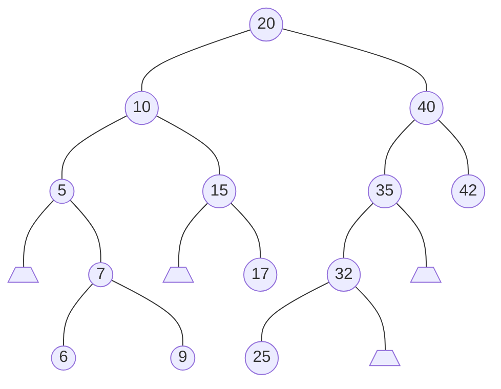

Exercices : [1](#1) [2](#2) [3](#3) [4](#4) [5](#5) 

<div id="1"></div>

## Exercice 1
[Télécharger l'exercice exo1.c](https://data2.cy.deltahmed.fr/DATA/info/DS2-2022-2023_Informatique3-DSp2s1/exo1.c){:target="_blank"} 

{: .w-75 .shadow .rounded-10 }


+  1. Arbre obtenu.
 




+  2. Parcours préfixe
 

```c 
20 10 5 7 6 9 15 17 40 35 32 25 42
``` 


+  3. Parcours infixe
 

```c 
5 6 7 9 10 15 17 20 25 32 35 40 42
``` 


+  4. Parcours postfix
 

```c
6 9 7 5 17 15 10 25 32 35 42 40 20
``` 


+  5. Fonction parcours postfix
 

```c 
#include <stdio.h>
#include <stdlib.h>

typedef struct arbre_struct
{
    int value;
    struct arbre_struct* fd;
    struct arbre_struct* fg;
} Arbre;

void parcoursPostfixe(Arbre* a)
{
    if (a != NULL)
    {
        parcoursPostfixe(a->fg);
        parcoursPostfixe(a->fd);
        printf("%d", a->value);
    }
}
```


+  6. Ecrire la fonction `Arbre* suppMin(Arbre* pA, int* pElt)`
 

```c 

Arbre *SuppMin(Arbre* pA , int* pElt)
{
    if (pA->fg != NULL)
        pA->fg = SuppMin(pA->fg, pElt);
    else
    {
        *pElt = pA->value;
        Arbre *tmp = pA;
        pA = pA->fd;
        free(tmp);
    }
    return pA;
}

``` 

<div id="2"></div>

## Exercice 2
[Télécharger l'exercice exo2.c](https://data2.cy.deltahmed.fr/DATA/info/DS2-2022-2023_Informatique3-DSp2s1/exo2.c){:target="_blank"} 

{: .w-75 .shadow .rounded-10 }

+  1. Ecrire une fonction qui va calculer la hauteur d’un arbre
 

```c 
#include <stdio.h>
#include <stdlib.h>

typedef struct arbre_struct
{
    int value;
    struct arbre_struct* fd;
    struct arbre_struct* fg;
} Arbre;

int max(int a, int b){
    return a > b ? a : b;
}

int hauteur(Arbre* a)
{
    if (a == NULL)
        return -1; // On commence a 0
    return 1 + max(hauteur(a->fg), hauteur(a->fd));
}

``` 


>  la notation ``a > b ? a : b est équivalente à if (a > b) {return a;} else {return b;}
{: .prompt-tip }


+  2. Ecrire une fonction qui retourne 1 si l’arbre passé en paramètre est équilibré, et retourne 0 dans le cas contraire

+  On peut utiliser la fonction `hauteur` car les fonctions demandées dans cet exercice ne doivent pas être nécessairement optimales d’un point de vue complexité temporelle (note en bas de l'exercice)
 

```c 
int ArbreEquilibre(Arbre* a)
{
    if (a == NULL)
    { 
        return 1;
    }
    int eq = hauteur(a->fd) - hauteur(a->fg);
    if (eq < -1 || eq > 1)
    {
        return 0;
    }

    return ArbreEquilibre(a->fg) && ArbreEquilibre(a->fd);
}

``` 

<div id="3"></div>

## Exercice 3
[Télécharger l'exercice exo3.c](https://data2.cy.deltahmed.fr/DATA/info/DS2-2022-2023_Informatique3-DSp2s1/exo3.c){:target="_blank"} 

{: .w-75 .shadow .rounded-10 }

+  Ecrire une fonction qui retourne 1 si un arbre est complet, 0 sinon.
 

```c 
#include <stdio.h>
#include <stdlib.h>

typedef struct arbre_struct
{
    int value;
    struct arbre_struct* fd;
    struct arbre_struct* fg;
} Arbre;

int estComplet(Arbre* a)
{
    return a == NULL || ( (!(a->fd == NULL ^ a->fg == NULL)) && estComplet(a->fg) && estComplet(a->fd));
}

``` 


>  Le signe `^` est une operation booléenne correspond au $XOR$ appelé aussi "ou exclusif", on l'utilise car si un des deux est `NULL` et l'autre non alors on retourne 0
{: .prompt-tip }

<div id="4"></div>

## Exercice 4
[Télécharger l'exercice exo4.c](https://data2.cy.deltahmed.fr/DATA/info/DS2-2022-2023_Informatique3-DSp2s1/exo4.c){:target="_blank"} 

{: .w-75 .shadow .rounded-10 }

+  Ecrire une fonction miroir qui va modifier l’arbre afin d’ajouter une partie à droite qui sera le miroir de la partie à gauche
 

```c 
#include <stdio.h>
#include <stdlib.h>

typedef struct arbre_struct
{
    int value;
    struct arbre_struct* fd;
    struct arbre_struct* fg;
} Arbre;

Arbre* creerArbre(int e)
{
    Arbre* new = malloc(sizeof(Arbre));
    if (new == NULL)
    { // Vérifie si l'allocation mémoire a réussi
        exit(EXIT_FAILURE);
    }
    new->fd = NULL; // Initialisation du fils droit à NULL
    new->fg = NULL; // Initialisation du fils gauche à NULL
    new->value = e; // Assigne la valeur au nœud
    return new;
}

void copierArbre(Arbre* source, Arbre* dest)
{
    if (source != NULL)
    {

        if (source->fg != NULL)
            dest->fd = creerArbre(source->fg->value);
        if (source->fd != NULL)
            dest->fg = creerArbre(source->fd->value);

        copierArbre(source->fg, dest->fd);
        copierArbre(source->fd, dest->fg);
    }
}
Arbre* miroir(Arbre* a)
{
    if ( a != NULL && a->fg != NULL && a->fd == NULL)
    {
        a->fd = creerArbre(a->fg->value);
        miroirREC(a->fg, a->fd);
    } 
    return a;
}
```


<div id="5"></div>

## Exercice 5
[Télécharger l'exercice exo5.c](https://data2.cy.deltahmed.fr/DATA/info/DS2-2022-2023_Informatique3-DSp2s1/exo5.c){:target="_blank"} 

{: .w-75 .shadow .rounded-10 }

+  1. Ecrire la structure permettant de construire un arbre contenant un caractère.
 

```c 
#include <stdio.h>
#include <stdlib.h>

typedef struct arbre_struct
{
    char* value;
    struct arbre_struct* fd;
    struct arbre_struct* fg;
} Arbre;

``` 


+  2. Ecrire une fonction int `motExistant (Arbre *a, char *mot)` qui va retourner 1 si la chaîne de caractères mot est dans l’arbre, et qui va retourner 0 sinon
 

```c 

int motExistant(Arbre *a, char *mot) {
    if (a == NULL || mot == NULL) {
        return 0; 
    }

    if (*mot == '\0') {
        return 1; 
    }

    if (*mot == a->value) {
        return motExistant(a->fg, mot + 1) || motExistant(a->fd, mot + 1);
    }

    return motExistant(a->fg, mot) || motExistant(a->fd, mot);
}
```

Exercices : [1](#1) [2](#2) [3](#3) [4](#4) [5](#5) 
