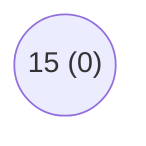
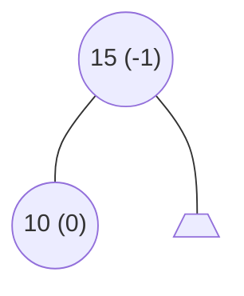
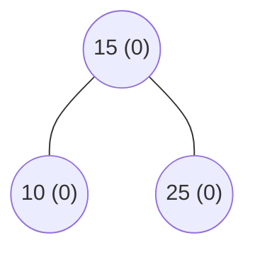
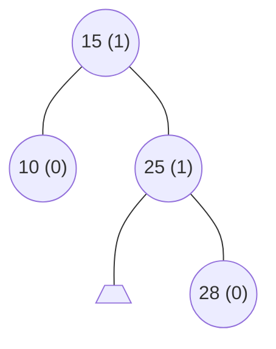
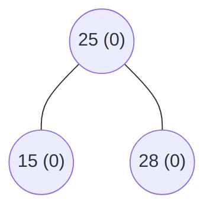
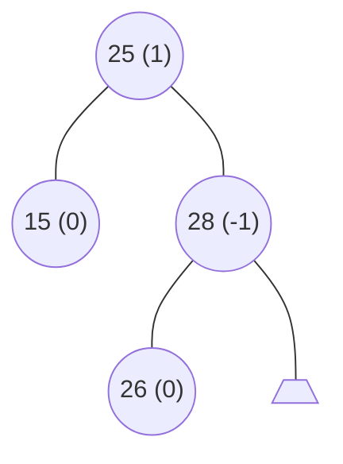
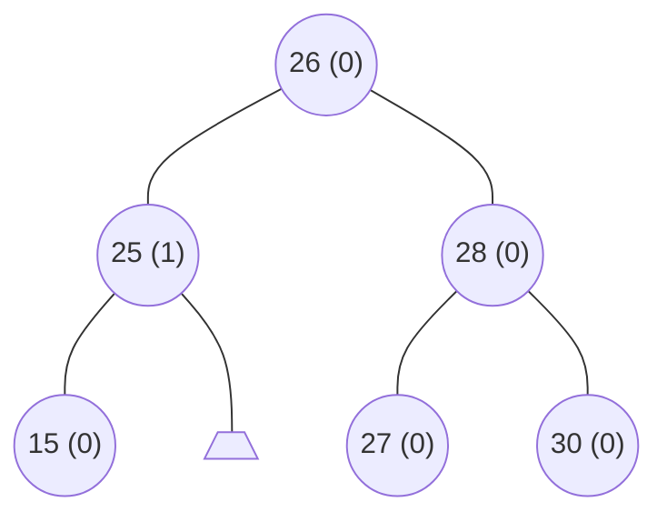
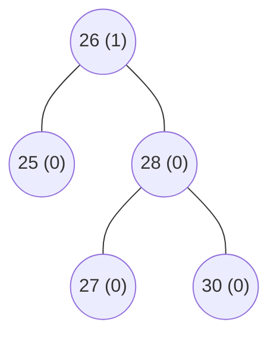

Exercices : [1](#1) [2](#2) [3](#3) [4](#4) 

<div id="1"></div>

## Exercice 1

{: .w-75 .shadow .rounded-10 }


+  a) Ajouter 15
 




+  b) Ajouter 10
 




+  c) Ajouter 25
 




+  d) Ajouter 28
 




+  e) Supprimer 10
 




+  f) Ajouter 26
 




+  g) Ajouter 30 
 


+  h) Ajouter 27
 




+  i) Supprimer 15
 




+  2. Definir la structure Arbre permettant de construire un AVL.
 

```c 
#include <stdio.h>
#include <stdlib.h>

typedef struct arbre_struct
{
    int value;
    int eq;
    struct arbre_struct* fd;
    struct arbre_struct* fg;
} AVL;

AVL* rotationGauche(AVL* a)
{
    AVL* pivot = a->fd; // Le fils droit devient le pivot
    int eq_a = a->eq, eq_p = pivot->eq;

    a->fd = pivot->fg; // Le sous-arbre gauche du pivot devient le fils droit de `a`
    pivot->fg = a;     // `a` devient le fils gauche du pivot

    // Mise à jour des facteurs d'équilibre
    a->eq = eq_a - max(eq_p, 0) - 1;
    pivot->eq = min3(eq_a - 2, eq_a + eq_p - 2, eq_p - 1);

    return pivot; // Le pivot devient la nouvelle racine
}

AVL* rotationDroite(AVL* a)
{
    AVL* pivot = a->fg; // Le fils gauche devient le pivot
    int eq_a = a->eq, eq_p = pivot->eq;

    a->fg = pivot->fd; // Le sous-arbre droit du pivot devient le fils gauche de `a`
    pivot->fd = a;     // `a` devient le fils droit du pivot

    // Mise à jour des facteurs d'équilibre
    a->eq = eq_a - min(eq_p, 0) + 1;
    pivot->eq = max3(eq_a + 2, eq_a + eq_p + 2, eq_p + 1);

    return pivot; // Le pivot devient la nouvelle racine
}

AVL* doubleRotationGauche(AVL* a)
{
    a->fd = rotationDroite(a->fd);
    return rotationGauche(a);
}

``` 

<div id="2"></div>

## Exercice 2

{: .w-75 .shadow .rounded-10 }

+  Racine `/` : Il s'agit du répertoire principal (le sommet) du système de fichiers Unix. Tous les fichiers et répertoires du système en dépendent.

+  Répertoire de connexion : C'est le répertoire personnel d'un utilisateur spécifique, souvent situé dans `/home/nom_utilisateur`. Pour l'utilisateur `root`, ce répertoire est généralement `/root`.
 
+  Le symbole `|` permet de rediriger la sortie standard (`stdout`) d'une commande vers l'entrée standard (`stdin`) d'une autre commande. 

+  Chemin absolu : Indique la localisation d’un fichier ou d’un répertoire à partir de la racine

+  Chemin relatif : Indique la localisation par rapport au répertoire courant (où vous êtes actuellement).

+  Types de fichiers

    +  Fichiers réguliers : Contiennent des données (texte, binaire, programmes, etc.).
 
    +  Répertoires : Contiennent des listes de fichiers ou sous-répertoires.

    +  Liens symboliques : Pointeurs vers d'autres fichiers ou répertoires.

+ Chaque fichier possède trois types de droits :

    + Lecture (r) : Permet de lire le contenu du fichier.
    + Écriture (w) : Permet de modifier ou supprimer le fichier.
    + Exécution (x) : Permet d'exécuter le fichier s'il s'agit d'un programme ou script.

+ Ces droits sont définis pour trois catégories d'utilisateurs :

    + Propriétaire (user) : L'utilisateur qui possède le fichier.
    + Groupe (group) : Les membres du groupe auquel appartient le fichier.
    + Autres (others) : Tous les autres utilisateurs.

+ Exemple Représentation des droits avec la commande `ls -l` : `-rw-r--r--`
+ Le premier caractère indique le type de fichier (- pour un fichier, d pour un dossier).
    + `rw-` : Le propriétaire peut lire et écrire.
    + `r--` : Le groupe peut seulement lire.
    + `r--` : Les autres peuvent seulement lire.

+ La chaîne `2>&1` est utilisée dans les commandes de terminal Unix pour rediriger les flux de sortie :
    + `1` : Représente la sortie standard (stdout).
    + `2` : Représente la sortie d'erreur standard (stderr).
    + `>` : Est l'opérateur de redirection.
    +  `&1` : Signifie que la sortie d'erreur standard (2) doit être redirigée vers la même destination que la sortie standard (1).

<div id="3"></div>

## Exercice 3

{: .w-75 .shadow .rounded-10 }

-  1\. `sort t.txt -k1 -n -r`
-  2\. `sort t.txt -k3 | sort -k4 -n -s | tr -s ' ' | cut -d' ' -f3-5`
-  3\. `grep -i "Culberston" t.txt | tr 'a-z' 'A-Z'`

<div id="4"></div>

## Exercice 4
[Télécharger l'exercice moyenne.sh](https://data2.cy.deltahmed.fr/DATA/info/DS3-2022-2023_Informatique3-DSp2s1/moyenne.sh){:target="_blank"} 

[Télécharger l'exercice cptrm.bash](https://data2.cy.deltahmed.fr/DATA/info/DS3-2022-2023_Informatique3-DSp2s1/cptrm.bash){:target="_blank"} 

{: .w-75 .shadow .rounded-10 }

{: .w-75 .shadow .rounded-10 }

```shell
#!usr/bin/bash

if [ $# -eq 0 ] ; then 
    echo "Arguments vides"
    exit 1
fi

sum=0

for arg in "$@"; do
    echo "$arg" | grep -q -E '^[0-9]+$'
    if [ $? -eq 0 ] && [ $arg -le 20 ] ; then
        sum=$((sum + arg)) 
    else
        echo "Error in parameters"
        exit 1
    fi
done

r=$(echo "scale=2; $sum / $#" | bc)

comp=$(echo "$r < 7" | bc)
comp2=$(echo "$r >= 10" | bc)
comp3=$(echo "$r >= 16" | bc)

if [ ${comp} -eq 1 ] ; then 
    echo "$r : redoubement"
elif [ ${comp2} -eq 1 ] && [ ${comp3} -eq 0 ] ; then 
    echo "$r : passage"
elif [ ${comp3} -eq 1 ] ; then 
    echo "$r : félicitaion"
else
    echo "$r : rattrapage"
fi

```

```shell
#!usr/bin/bash

if [ $# -ne 2 ] ; then 
    echo "Erreur ! syntaxe d'appel ./cptrm.bash f1 f2"
    exit 1
fi

cd
find -iname "$1" -exec wc -l {} \;

if [ $? -ne 0 ] ; then 
    echo "Erreur de suppression"
    exit 1
fi

find -iname "$2" -delete

if [ $? -ne 0 ] ; then 
    echo "Erreur de suppression"
    exit 1
fi
```

Exercices : [1](#1) [2](#2) [3](#3) [4](#4) 
